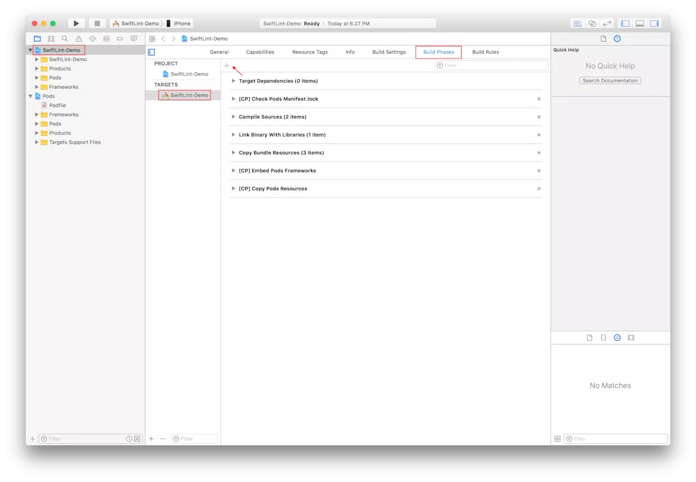
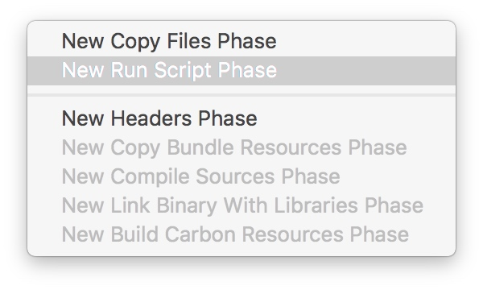
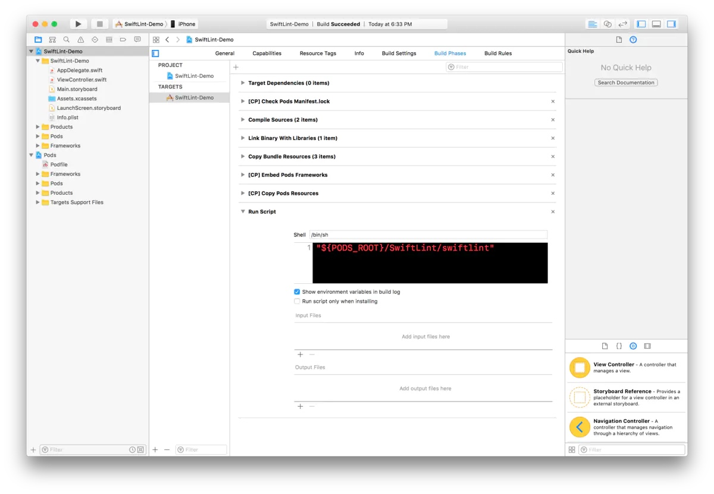

# SwiftLint + Xcode 简单配置
团队中，规范很重要。最近公司项目在向Swift转型，入门Swift，如何才能保证大家的代码质量。SwiftLint为我们提供了各种语言规范的检验。
SwiftLint 是一个用于强制检查 Swift 代码风格和规定的一个工具，基本上以 GitHub's Swift 代码风格指南为基础。

SwiftLint Hook 了 Clang 和 SourceKit 从而能够使用 AST 来表示源代码文件的更多精确结果。
本文中，为大家介绍最简单的安装方案，在代码中引入swiftLint，直接在项目中报警告
## pod 引入
将如下代码添加到你的 Podfile 即可：

```
pod 'SwiftLint'
```
打开终端执行pod update。把 SwiftLint 的二进制文件和依赖下载到 Pods/ 目录下。
## 配置Xcode执行脚本






添加如下脚本

```
"${PODS_ROOT}/SwiftLint/swiftlint"
```




添加完脚本之后，重新编译即可（Cmd + B），默认的空项目其实已经暗含了很多与 Swift Style 不符合的风格，如果你也受不了这么多警告和错误，那就去一个个修复它吧。


## 配置文件
Swift Lint 在完成上述操作之后，便已经生效。但是，如果觉得默认的风格过于严格，或者项目组有另外的要求，Swift Lint 也可以定制相应的风格，或者禁用某些规则。
创建 额外的配置文件 `.swiftlint.yml ` 直接放在项目根目录。
 .yml类型文件可以文本文件后缀直接改为.yml进行创建。并且该类型的文件为不可见文件类型，怎样设置为可见自行配置。
 如下是我们团队配置的  yml 文件
 
```
disabled_rules: # 执行时排除掉的规则
  - trailing_newline #文件（属性、方法）结束的的时候（“}”之前）， 应该有一个空格新行
  - trailing_whitespace # 函数方法结束后,不建议添加空格行,和vertical_whitespace貌似有冲突
  - vertical_whitespace # 垂直方向上的空格行，限制为一行（注释除外）
#  - line_length #每行长度
  - multiple_closures_with_trailing_closure #当函数有多个闭包时, 不建议使用尾随闭包语法
#  - control_statement
opt_in_rules: # 一些规则仅仅是可选的
#  - empty_count
#  - missing_docs
  # 可以通过执行如下指令来查找所有可用的规则:
  # swiftlint rules
included: # 执行 linting 时包含的路径。如果出现这个 `--path` 会被忽略。
  - BusinessTeam
excluded: # 执行 linting 时忽略的路径。 优先级比 `included` 更高。
  - Carthage
  - Pods

# 可配置的规则可以通过这个配置文件来自定义
# 二进制规则可以设置他们的严格程度
#force_cast: warning # 隐式
force_try:
  severity: warning # 显式
# 同时有警告和错误等级的规则，可以只设置它的警告等级
# 隐式
line_length: #每行长度
  - 250
  - 400
#  warning: 250
#  ignores_function_declarations: true
#  ignores_comments: true
# 可以通过一个数组同时进行隐式设置
# 方法长度
function_body_length:
  - 90
  - 200
type_body_length:
  - 300 # warning
  - 400 # error
# 或者也可以同时进行显式设置
file_length:
  warning: 600
  error: 1200
# 命名规则可以设置最小长度和最大程度的警告/错误
# 此外它们也可以设置排除在外的名字
type_name:
  min_length: 3 # 只是警告
  max_length: # 警告和错误
    warning: 40
    error: 50
#  excluded: iPhone # 排除某个名字
identifier_name: #变量名长度限制
  min_length: 3 # 只是警告
  max_length: # 警告和错误
    warning: 40
    error: 50

#variable_name:
#  min_length: # 只有最小长度
#    error: 4 # 只有错误
#  excluded: # 排除某些名字
#    - id
#    - URL
#    - GlobalAPIKey
reporter: "xcode" # 报告类型 (xcode, json, csv, checkstyle)

```

## 结束语
针对自定义规则，官方为我们提供了很多，后面会专门有文章来介绍每种规则以及对应的使用方法